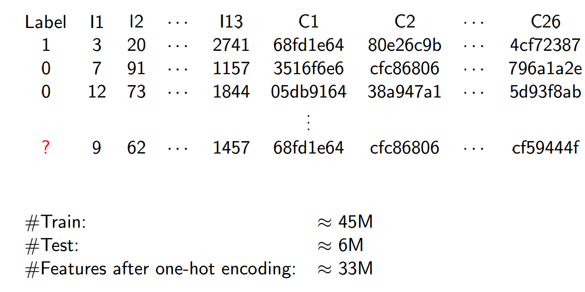

# 比赛排名第一的解法（来自3idiots）

这篇文章主要翻译于作者的PPT。

## 整理资料来源

* kaggle论坛

  https://www.kaggle.com/c/criteo-display-ad-challenge/forums/t/10555/3-idiots-solution-libffm

* 实现方法的PPT

  http://www.csie.ntu.edu.tw/~r01922136/kaggle-2014-criteo.pdf

* 实现的代码

  https://github.com/guestwalk/kaggle-2014-criteo

* libffm工具包

  http://www.csie.ntu.edu.tw/~r01922136/libffm/

* libffm 源码

  https://github.com/guestwalk/libffm

## 作者

YuChin Juan, Yong Zhuang, and Wei-Sheng Chin

NTU CSIE MLGroup

在这次比赛中，在公共排行榜(public leaderboards)的分数为0.44488在私有排行榜(private leaderboards)上的排名是0.44479。
分数为log损失函数,分数越小排名越高。

## 实现概述

数据总共有13列数值特征，26列类别特征(hashcode),作者首先将13列数值特征与26列类别特征(选取出现的比例非常高的一些类型作为特征，使用one-hot进行编码)放入gbdt中训练30棵高度均为7的树，每棵树作为一个特征，共有30个特征，特征的值是最后显现出值的叶子节点的序号，即这个值为0-255，作者最后将13+26+30一共69个特征的标签经过hash处理，然后与10^6取模做为特征的索引，值仍用原来特征的值，获取到10^6个one-hot编码后的稀疏特征矩阵，放入FFM模型中进行训练。

## 小规模数据

作者为了演示算法的效果，采样了一份小数据集，可以看到如之前所述，数据第一列为标签，1代表点击，0代表未点击，最后?表示需要预测0-1的一个点击的概率值，I1-I13表示13个数值型特征，C1-C26表示26个类别特征，使用32位hashcode表示。

小规模数据中训练数据大约45Mb,测试数据大约6Mb,特征数据经过one-hot编码后大约33Mb。

## 技术路线

总体的实现方案如上图所示，CSV表示输入的数据文件，
### Pre-A
目标：为GBDT生成特征的算法提供训练的文件
使用的特征包括：
* 包括所有数值型特征(13个特征)，正常编码
* 类型特征(如果在one-hot编码后出现超过400万个特征)(26个特征)，使用稀疏矩阵编码

### GBDT

目标：生成GBDT特征30个
* 在GBDT中使用树生成特征
* 使用的树是深度为7的30个树
* 生成的是这30棵树每棵最显著的叶子节点的序号，也就是生成了30个特征，特征值是每棵树的叶子节点所在的序号
* 这个方法是Xinran He et al发表的(Facebook).
* GBDT的实现方法在
* GBDT的实现是基于下面这篇文章的Algorithm 5
  http://statweb.stanford.edu/~jhf/ftp/trebst.pdf

### Pre-B

目标: 为FFM算法生成特征
* 数值特征(I1-I13)如果超过2根据下面的公式进行转换,根据代码可以看到，这个公式是超过2的数字求自然对数，然后平方，最后向上取整, 这个值和特征所在的列(比如第12列表示为I12)组合生成特征名称, 如果值为3那么特征的名称为I12-3,这就是one-hot的一个特征,含义就是如果这个样本在第I12位置上值为3,I12-3这个特征值为1,否则为0

* 类别特征(C1-C26)如过出现少于10次的被统一的定义为一个特殊的值,例如C9列出现了一个值为a73ee510标签，我们将C9-a73ee510作为一个特征,这就是one-hot的一个特征,含义就是如果这个样本在第C9位置上值为a73ee510,C9-a73ee510这个特征值为1,否则为0
* GBDT的30个特征直接被引用,为一个1-255的正数,例如第12棵树的65个叶子节点为显性，那么12:65就是one-hot的一个特征,含义就是如果这个样本在GBDT特征12的位置上值为65,12:65这个特征值为1,否则为0
* 以上的13 + 26 + 30个特征(one-hot之前),如果直接进行one-hot会非常的麻烦(特征对齐就很麻烦),作者使用了hash技巧,将刚才所述的3种特征的名称进行hash,然后与10^6取余(这个数字是1百万,对类型特征C1-C6进行one-hot编码特征大约400万,作者对出现少于10次的特征进行规约,应该是已经把特征降到了100万以内,所以此处使用这个数字,此处推断还未考证),这样特征空间的大小为10^6,所有的特征值为0或者1,表示有或者没有出现。

### Calib(calibrate) 标准化
作者经过各种调参发现，整体的预测和真实结果有一定的偏差，将预测结果(点击的概率)减少0.003，log损失可以减少0.0001

### Rst(result) 输出文件

## 特征工程

## 多算法对比实验

## 实验运行情况

双6核CPU环境下的运行状况，所有的进程都是并行的

## FFM算法
