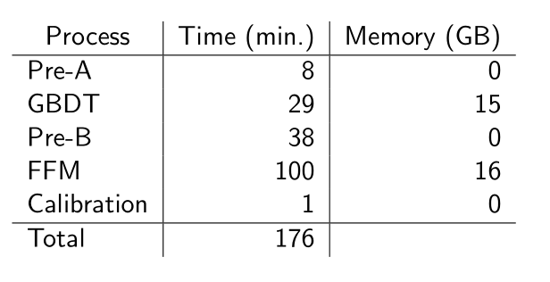

# 比赛排名第一的解法（来自3idiots）

## 整理资料来源

* kaggle论坛

  https://www.kaggle.com/c/criteo-display-ad-challenge/forums/t/10555/3-idiots-solution-libffm

* 实现方法的PPT

  http://www.csie.ntu.edu.tw/~r01922136/kaggle-2014-criteo.pdf

* 实现的代码

  https://github.com/guestwalk/kaggle-2014-criteo

* libffm工具包

  http://www.csie.ntu.edu.tw/~r01922136/libffm/

* libffm 源码

  https://github.com/guestwalk/libffm

## 作者

YuChin Juan, Yong Zhuang, and Wei-Sheng Chin

NTU CSIE MLGroup

在这次比赛中，在公共排行榜(public leaderboards)的分数为0.44488在私有排行榜(private leaderboards)上的排名是0.44479。

## 小规模数据

作者为了演示算法的效果，采样了一份小数据集，可以看到如之前所述，数据第一列为标签，1代表点击，0代表未点击，最后？表示需要预测0-1的一个点击的概率值，I1-I13表示。。。//Todo

## 技术路线

总体的实现方案如上图所示，CSV表示输入的数据文件，
Pre-A
Calib(calibrate)表示标准化
Rst(result)最后的输出文件

## 多算法对比实验

## 实验运行情况

双6核CPU环境下的运行状况，所有的进程都是并行的

## FFM算法
